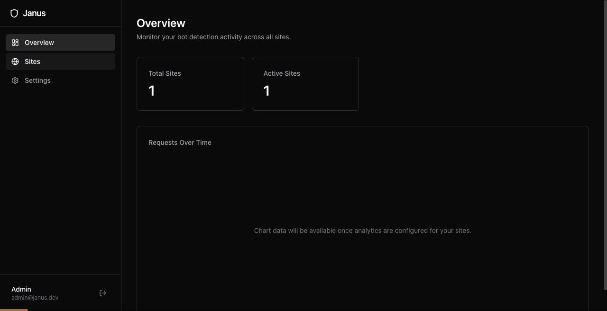
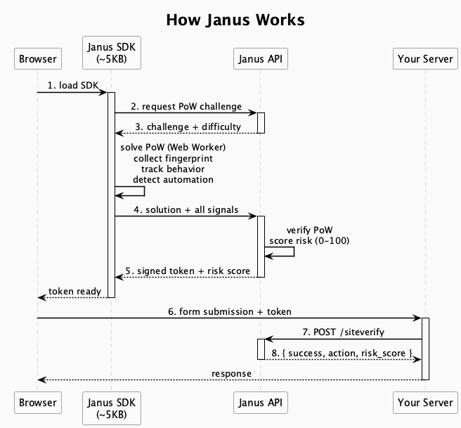
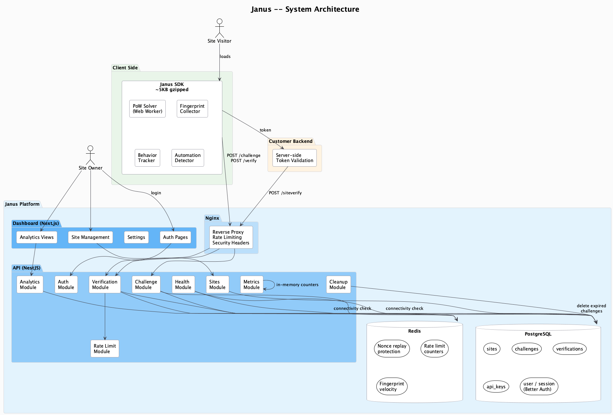
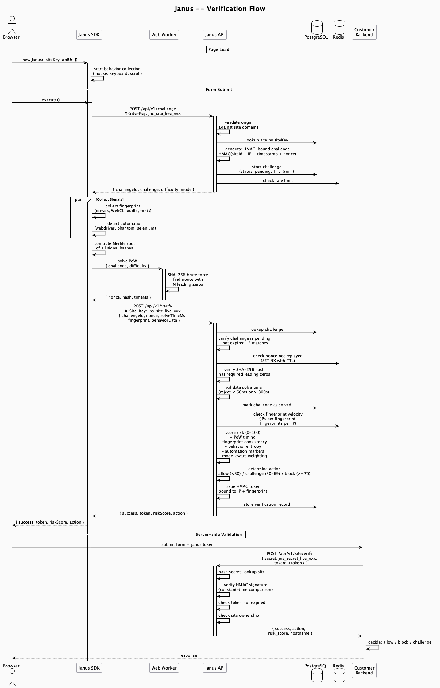
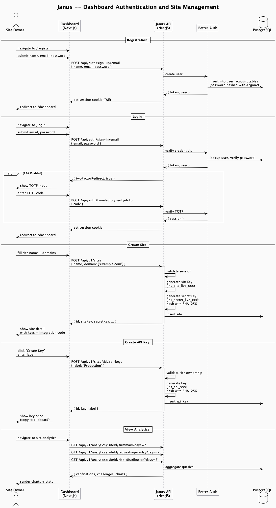
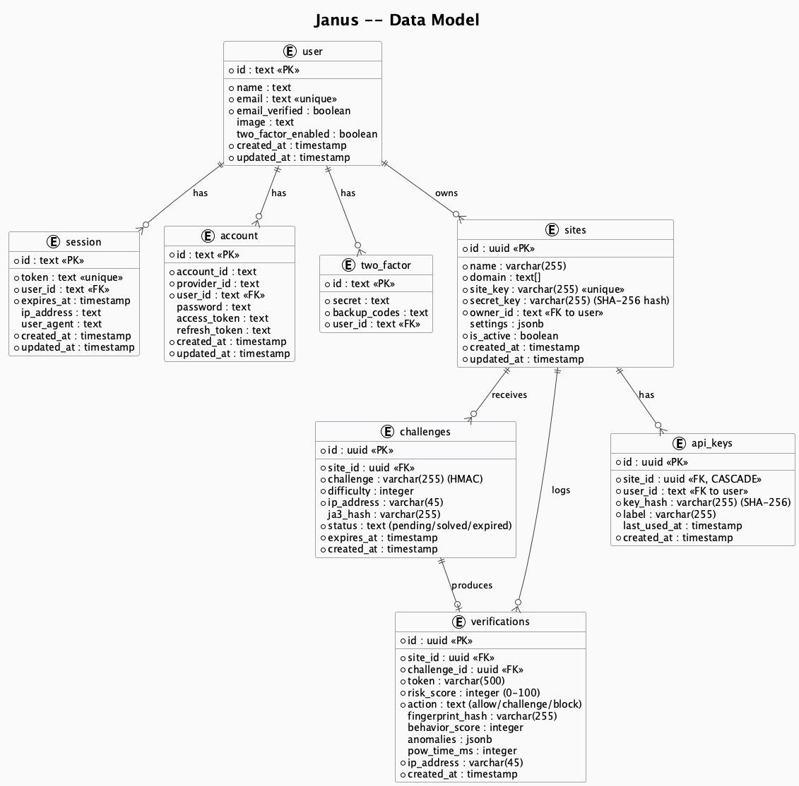
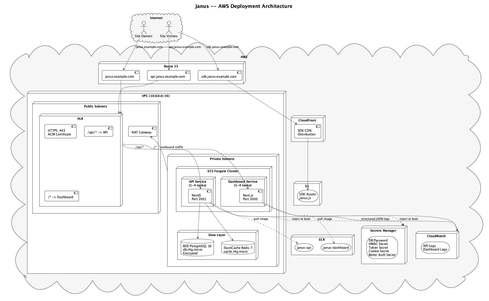

<p align="center">
  
  
  
  
</p>

# Janus

**Bot detection you own.** A self-hosted alternative to Cloudflare Turnstile. No third-party scripts. No user tracking. No data leaving your servers.

Janus protects your forms, logins, and APIs from bots using proof-of-work challenges, browser fingerprinting, behavioral analysis, and cross-signal validation. You deploy it on your own infrastructure and keep full control.

<p align="center">
  
</p>

---

## Why Janus

|                  | Turnstile / reCAPTCHA         | Janus                           |
| ---------------- | ----------------------------- | ------------------------------- |
| **Data**         | Sent to Cloudflare/Google     | Stays on your servers           |
| **Privacy**      | Third-party cookies, tracking | Zero tracking, no cookies       |
| **Control**      | Black box scoring             | Open source, tunable thresholds |
| **Availability** | Depends on external service   | Runs on your infra              |
| **Cost**         | Free tier with limits         | Free forever, self-hosted       |
| **SDK size**     | 50-200KB                      | ~5KB gzipped                    |

---

## How It Works



The SDK runs in the background. It solves a proof-of-work challenge in a Web Worker (non-blocking), collects browser fingerprints, tracks mouse and keyboard behavior, and checks for automation markers. All of this happens invisibly, without any user interaction.

The server scores each request from 0 (human) to 100 (bot) and returns a signed token. Your backend validates that token with a single API call.

---

## Features

### Detection Engine

- **Proof-of-work challenges** with configurable difficulty (SHA-256, solved in Web Worker)
- **Browser fingerprinting** via canvas, WebGL, audio context, fonts, and navigator properties
- **Behavioral analysis** tracking mouse velocity variance, keyboard timing, scroll patterns, and touch events
- **Automation detection** for Selenium, Puppeteer, PhantomJS, Nightmare, and CDP-based tools
- **Cross-signal validation** to catch bots that fake individual signals but miss correlations
- **Fingerprint velocity tracking** to detect bot farms reusing browser profiles across IPs
- **Mode-aware scoring** that adjusts behavioral expectations based on invisible vs managed mode
- **GeoIP intelligence** using self-hosted MaxMind GeoLite2 databases — detects datacenter IPs, VPNs, proxies, and per-site blocked countries without storing IP-to-location mappings (GDPR-safe)

### Platform

- **Admin dashboard** with site management, real-time analytics, verification logs, and policy configuration
- **Site-scoped API keys** with SHA-256 hashing and last-used tracking
- **Two-factor authentication** (TOTP) for dashboard accounts
- **Domain allowlisting** with origin validation on every challenge and verification request
- **Two-tier rate limiting** at both Nginx and application layers (per IP, per site, per fingerprint)
- **Prometheus metrics** at `/metrics` for monitoring verification rates, risk distributions, and challenge counts
- **Health checks** at `/health` and `/ready` with database and Redis connectivity verification
- **Automatic cleanup** of expired challenges every 5 minutes
- **Structured JSON logging** for production log aggregation

### Security

- All secrets required via environment variables, app refuses to start without them
- Client SDK treated as fully untrusted, every claim validated server-side
- HMAC token signatures verified with constant-time comparison (`crypto.timingSafeEqual`)
- IP extraction from `X-Real-IP` only (set by Nginx), never from client-controlled `X-Forwarded-For`
- Redis failures fail closed: rate limiting and replay protection deny requests when Redis is down
- Secret keys and API keys stored as SHA-256 hashes, never in plaintext
- Fingerprint payloads size-limited to 64KB to prevent abuse
- Nonce replay protection via Redis SET NX with TTL

---

## Architecture



Three components, one monorepo:

| Component     | Stack                                 | Purpose                                                          |
| ------------- | ------------------------------------- | ---------------------------------------------------------------- |
| **API**       | NestJS, Express, Drizzle ORM          | Challenge issuance, verification, risk scoring, token management |
| **Dashboard** | Next.js 15, React 19, Tailwind CSS 4  | Site management, analytics, settings, auth                       |
| **SDK**       | TypeScript, Rollup, zero dependencies | Browser-side signal collection and PoW solving                   |

Backed by PostgreSQL for persistent storage and Redis for rate limiting, nonce replay protection, and fingerprint velocity tracking.

---

## Verification Flow



Every verification goes through these stages:

1. **Challenge issuance.** The SDK requests a PoW challenge. The server generates an HMAC-bound challenge tied to the site, IP, and timestamp. The challenge includes the detection mode and difficulty level configured for the site.

2. **Signal collection.** While the PoW solver runs in a Web Worker, the SDK collects browser fingerprints (canvas, WebGL, audio, fonts, navigator), behavioral signals (mouse velocity, keyboard timing, scroll), and automation markers (webdriver, phantom, selenium, CDP).

3. **Proof-of-work.** The Web Worker finds a nonce that produces a SHA-256 hash with the required number of leading zeros. This is non-blocking and typically takes 1-3 seconds on consumer hardware.

4. **Verification.** The server validates the PoW solution, checks for nonce replay, validates solve timing, analyzes fingerprint consistency and velocity, scores behavioral entropy, and produces a risk score from 0 to 100.

5. **Token issuance.** If the score is below the block threshold, the server issues an HMAC-signed token bound to the IP and fingerprint. The token has a 5-minute TTL.

6. **Server-side validation.** Your backend sends the token to `/api/v1/siteverify` with your secret key. Janus returns `success`, `action`, and `risk_score`.

---

## Dashboard and Site Management



The dashboard is where you manage your protected sites. Each site gets its own key pair, detection settings, and API keys.

**What you can do from the dashboard:**

- Register sites with domain allowlists
- View and rotate site keys and secret keys
- Create site-scoped API keys for server-side verification
- Configure PoW difficulty, detection mode (invisible/managed), and risk thresholds
- View analytics: request volume, pass/fail ratios, risk score distributions, top IPs
- Browse paginated verification logs with risk scores, actions, and anomaly details
- Enable TOTP two-factor authentication for your account
- Manage active sessions and revoke devices

---

## Data Model



| Table                        | What it stores                                                                                       |
| ---------------------------- | ---------------------------------------------------------------------------------------------------- |
| **sites**                    | Registered sites with domain arrays, key pairs (secret hashed), detection settings (JSONB)           |
| **challenges**               | Issued PoW challenges with HMAC binding, difficulty, IP, status, and 5-minute expiry                 |
| **verifications**            | Every verification result: risk score, action, fingerprint hash, behavior score, anomalies, PoW time |
| **api_keys**                 | Site-scoped API keys with SHA-256 hashed values, labels, and usage tracking                          |
| **user / session / account** | Better Auth tables for dashboard authentication and session management                               |

---

## Risk Scoring

Every verification produces a risk score from 0 (human) to 100 (bot). The score is built from multiple independent signals:

| Signal                        | Effect     | What It Catches                       |
| ----------------------------- | ---------- | ------------------------------------- |
| PoW solved in < 100ms         | +25        | GPU solvers, pre-computed answers     |
| PoW solved in 1-15s           | -10        | Normal browser performance            |
| No mouse or keyboard events   | +20        | Headless browsers, scripts            |
| High behavioral entropy       | -15        | Natural human movement patterns       |
| Low behavioral entropy        | +20        | Robotic, constant-speed movement      |
| Fingerprint inconsistency     | +10 to +20 | Spoofed browser properties            |
| High fingerprint velocity     | +15 to +25 | Bot farms recycling profiles          |
| `navigator.webdriver` is true | +40        | Selenium, Puppeteer, Playwright       |
| Managed mode, zero behavior   | +15        | Headless browser without interaction  |
| Invisible mode, low behavior  | +5         | Expected with short collection window |
| Missing JA3 hash              | +5         | Non-browser HTTP clients              |
| Datacenter/hosting IP         | +15        | AWS, GCP, Azure, DigitalOcean, etc.   |
| VPN detected                  | +10        | Anonymous VPN exit nodes              |
| Proxy detected                | +10        | Anonymous proxy services              |
| Blocked country               | +30        | Per-site country blocklist            |

**Default thresholds** (configurable per site in the dashboard):

- Score < 30: **allow** (issue token, zero friction)
- Score 30-69: **challenge** (increase PoW difficulty)
- Score >= 70: **block** (reject the request)

Detection mode matters. In **invisible mode**, behavior collection runs for ~150ms so low interaction is normal and penalized lightly. In **managed mode**, the user clicks a checkbox so the server expects real interaction and penalizes its absence more heavily.

---

## GDPR Compliance

Janus is privacy-first by design. It does not set cookies, does not use third-party scripts, and does not send data to external services. All data stays on your infrastructure.

The only personal data Janus stores is **IP addresses** in the challenges and verifications tables. Browser fingerprints are stored as one-way SHA-256 hashes that cannot be reversed. Behavioral signals are reduced to aggregate scores (e.g., "mouse velocity variance: 0.6"), not raw event logs. Neither of these can identify an individual on their own.

### GDPR mode

For site owners who want stricter IP handling, Janus supports a per-site **GDPR mode** that anonymizes IPs before storage and enforces automatic data retention.

| | Standard | GDPR Mode |
|---|---|---|
| Proof-of-work | Yes | Yes |
| Fingerprinting | Yes (SHA-256 hashed) | Yes (SHA-256 hashed) |
| Behavioral analysis | Yes (aggregate scores) | Yes (aggregate scores) |
| Automation detection | Yes | Yes |
| GeoIP intelligence | Yes (country code only) | Yes (country code only) |
| Risk scoring | All signals | All signals |
| IP storage | Full IP | Anonymized (last octet zeroed) |
| Data retention | Manual | Auto-delete after N days |

Enable it per site in the dashboard settings, or via the API:

```bash
curl -X PUT https://your-janus.com/api/v1/sites/:id \
  -H 'Content-Type: application/json' \
  -d '{"settings": {"gdprMode": true}}'
```

When enabled, IPs are truncated before storage (e.g., `192.168.1.0` instead of `192.168.1.47`). The full IP is still used during the request for challenge binding and rate limiting, but the stored verification record only contains the anonymized version.

### Data retention

Verification records and completed challenges are automatically deleted after a configurable retention period. Set `DATA_RETENTION_DAYS` in your environment (default: 30). Cleanup runs daily at 2am UTC.

### Right to erasure

Site owners can delete all stored data for a specific IP or fingerprint hash:

```
DELETE /api/v1/sites/:siteId/data?ip=192.168.1.47
DELETE /api/v1/sites/:siteId/data?fingerprint=abc123
```

Returns the count of deleted verification and challenge records.

### Privacy by design

- **No cookies.** The SDK is stateless and does not write to the visitor's browser storage.
- **No third-party scripts.** Everything runs on your servers.
- **No cross-site tracking.** Fingerprint hashes are site-scoped. The same browser produces different hashes on different sites.
- **No raw signal storage.** Mouse coordinates, keyboard timings, and canvas pixel data are never stored. Only hashed fingerprints and aggregate behavior scores are persisted.
- **No user profiles.** There is no concept of a "user" on the verification side. Each request is scored independently.

---

## GeoIP Intelligence

Janus includes optional GeoIP-based risk signals using self-hosted [MaxMind GeoLite2](https://dev.maxmind.com/geoip/geolite2-free-geolocation-data) databases. All lookups happen in-memory on your server — no IP data is sent to external services.

### How it works

1. When a verification request arrives, the IP is resolved to a country code and ASN using the local MaxMind database
2. The country code and network type flags (datacenter, VPN, proxy) feed into risk scoring
3. **Only the 2-letter country code** is stored in the verification record — the full IP-to-location mapping is never persisted
4. The full IP is then anonymized (in GDPR mode) or stored as usual

This design is GDPR-safe by construction: country codes are not personal data under GDPR because they cannot identify an individual.

### Setup

1. Create a free MaxMind account at [maxmind.com](https://www.maxmind.com/en/geolite2/signup)
2. Download the GeoLite2-City and GeoLite2-ASN databases (`.mmdb` format)
3. Place them in `data/geoip/` (or set `GEOIP_DB_PATH` to a custom directory):

```bash
mkdir -p data/geoip
# Copy your downloaded .mmdb files:
cp GeoLite2-City.mmdb data/geoip/
cp GeoLite2-ASN.mmdb data/geoip/
```

GeoIP is **fully optional**. If the database files are not present, Janus starts normally with geo-based signals disabled. A warning is logged at startup.

### Risk signals

| Signal              | Effect | What It Catches                            |
| ------------------- | ------ | ------------------------------------------ |
| Datacenter IP       | +15    | Requests from AWS, GCP, Azure, DO, etc.    |
| VPN detected        | +10    | Traffic through anonymous VPN exit nodes    |
| Proxy detected      | +10    | Anonymous proxy services                   |
| Blocked country     | +30    | Country on the site's blocklist             |

### Per-site blocked countries

You can block specific countries per site via the dashboard or API:

```bash
curl -X PUT https://your-janus.com/api/v1/sites/:id \
  -H 'Content-Type: application/json' \
  -d '{"settings": {"blockedCountries": ["XX", "YY"]}}'
```

Requests from blocked countries receive a +30 risk score penalty, which in most configurations pushes them into the `block` action.

---

## Quick Start

### Prerequisites

- Node.js 20+
- Docker (for PostgreSQL and Redis)

### Development

```bash
git clone https://github.com/elliot736/janus.git
cd janus
npm install

# Generate secrets
cp .env.example .env
# Edit .env, fill each secret with: openssl rand -hex 32

# Start database and cache
docker compose -f docker-compose.yml -f docker-compose.dev.yml up postgres redis -d

# Set up schema
cd apps/api
npx drizzle-kit push
echo "y" | npx @better-auth/cli generate
npx drizzle-kit push
cd ../..

# Seed test data (3 sites, API keys, 7 days of verification history)
cd apps/api && npm run db:seed && cd ../..

# Run everything
npm run dev
```

The seed script creates three sites (Production, Staging, Landing Page) with different detection configs, four site-scoped API keys, and ~500 verifications spread over 7 days with realistic traffic patterns. It prints all credentials in a formatted table so you can start testing immediately.

Dashboard: `http://localhost:3000`
API: `http://localhost:3001`

### Production (Docker Compose)

```bash
cp .env.example .env
# Fill in all secrets
docker compose up -d
```

This starts five containers: Nginx (port 80/443), API, dashboard, PostgreSQL, and Redis. Nginx handles TLS termination, path-based routing, rate limiting, and security headers. The API and dashboard are not directly exposed.

---

## Integration

### Step 1: Create a site

Sign in to the dashboard, create a site, and save your site key and secret key.

### Step 2: Add the SDK to your page

**HTML:**

```html
<script src="https://your-janus.com/sdk.js"></script>
<script>
  const janus = new Janus.Janus({
    siteKey: "jns_site_live_xxxxxxxxxxxx",
    apiUrl: "https://your-janus.com",
    mode: "invisible",
  });

  document.querySelector("form").addEventListener("submit", async (e) => {
    e.preventDefault();
    const result = await janus.execute();
    if (result.success) {
      document.querySelector("[name=janus-token]").value = result.token;
      e.target.submit();
    }
  });
</script>
```

**Programmatic:**

```typescript
const janus = new Janus.Janus({
  siteKey: "jns_site_live_xxxxxxxxxxxx",
  apiUrl: "https://your-janus.com",
  mode: "invisible",
});

const { success, token, riskScore, action } = await janus.execute();
```

### Step 3: Validate the token server-side

```javascript
const res = await fetch("https://your-janus.com/api/v1/siteverify", {
  method: "POST",
  headers: { "Content-Type": "application/json" },
  body: JSON.stringify({
    secret: process.env.JANUS_SECRET_KEY,
    token: req.body["janus-token"],
  }),
});

const { success, action, risk_score } = await res.json();

if (!success || action === "block") {
  return res.status(403).json({ error: "Verification failed" });
}
```

**Response:**

```json
{
  "success": true,
  "challenge_ts": "2026-03-22T10:00:00.000Z",
  "hostname": "example.com",
  "action": "allow",
  "risk_score": 15
}
```

---

## AWS Deployment



The `terraform/` directory contains production-ready AWS infrastructure. Everything is provisioned with a single `terraform apply`.

| Component     | Service             | Staging                   | Production                |
| ------------- | ------------------- | ------------------------- | ------------------------- |
| Compute       | ECS Fargate         | 0.5 vCPU, 1GB, 1 task     | 1 vCPU, 2GB, 2-4 tasks    |
| Database      | RDS PostgreSQL 16   | db.t4g.micro, single-AZ   | db.t4g.small, Multi-AZ    |
| Cache         | ElastiCache Redis 7 | cache.t4g.micro           | cache.t4g.small           |
| Load Balancer | ALB                 | HTTPS, ACM cert           | HTTPS, ACM cert           |
| CDN           | CloudFront          | SDK from S3               | SDK from S3               |
| DNS           | Route 53            | root, api, sdk subdomains | root, api, sdk subdomains |
| Secrets       | Secrets Manager     | auto-generated            | auto-generated            |
| Logs          | CloudWatch          | JSON structured           | JSON structured           |
| Metrics       | Prometheus          | /metrics endpoint         | /metrics endpoint         |
| Images        | ECR                 | 10-image retention        | 10-image retention        |

ECS services scale between 1 and 4 tasks based on CPU and memory utilization. Secrets are auto-generated on first apply and injected into ECS task definitions from Secrets Manager.

```bash
cd terraform
terraform init
terraform plan -var-file=environments/staging.tfvars
terraform apply -var-file=environments/staging.tfvars
```

---

## CI/CD

Four GitHub Actions workflows handle the full lifecycle:

| Workflow            | Trigger                 | Steps                                                                                    |
| ------------------- | ----------------------- | ---------------------------------------------------------------------------------------- |
| **ci.yml**          | PR / push to main       | Type-check all packages, build, run 92 unit tests                                        |
| **deploy.yml**      | Push to main            | Build Docker images, push to ECR, deploy to ECS, upload SDK to S3, invalidate CloudFront |
| **sdk-publish.yml** | Tag `sdk-v*`            | Verify bundle < 10KB gzipped, publish to npm                                             |
| **terraform.yml**   | Changes in `terraform/` | Plan on PR (comment on PR), apply on merge                                               |

AWS authentication uses OIDC with short-lived credentials. No long-lived access keys. Production deploys require manual approval via GitHub Environments.

---

## API Reference

### Public (used by SDK)

```
POST /api/v1/challenge
  Headers: X-Site-Key
  Returns: { challengeId, challenge, difficulty, mode, algorithm, expiresAt }

POST /api/v1/verify
  Headers: X-Site-Key
  Body:    { challengeId, nonce, solveTimeMs, fingerprint, behaviorData }
  Returns: { success, token, riskScore, action, expiresAt }
```

### Server-side validation

```
POST /api/v1/siteverify
  Body:    { secret, token, remoteip? }
  Returns: { success, challenge_ts, hostname, action, risk_score }
```

### Dashboard (authenticated)

```
Sites:          GET|POST /api/v1/sites
                GET|PUT|DELETE /api/v1/sites/:id
                POST /api/v1/sites/:id/rotate-keys

API Keys:       GET|POST /api/v1/sites/:siteId/api-keys
                DELETE /api/v1/api-keys/:id

Analytics:      GET /api/v1/analytics/:siteId/summary?days=7
                GET /api/v1/analytics/:siteId/requests-per-day?days=7
                GET /api/v1/analytics/:siteId/risk-distribution?days=7
                GET /api/v1/analytics/:siteId/top-ips?days=7&limit=10

Logs:           GET /api/v1/sites/:siteId/verifications?page=1&pageSize=50
```

### Operational

```
GET /health     Liveness (always 200)
GET /ready      Readiness (checks DB + Redis connectivity)
GET /metrics    Prometheus text format
```

---

## Project Structure

```
janus/
├── apps/
│   ├── api/                NestJS backend
│   │   └── src/
│   │       ├── auth/           Better Auth, 2FA
│   │       ├── challenge/      PoW issuance and verification
│   │       ├── verification/   Risk scoring, fingerprint, tokens
│   │       ├── sites/          Site CRUD, key rotation
│   │       ├── api-keys/       Site-scoped key management
│   │       ├── analytics/      Aggregation queries, verification logs
│   │       ├── rate-limit/     Redis sliding window limiter
│   │       ├── health/         Liveness and readiness probes
│   │       ├── metrics/        Prometheus counters
│   │       ├── cleanup/        Expired challenge cron
│   │       ├── geoip/          GeoIP lookups (MaxMind GeoLite2)
│   │       └── db/             Drizzle schema
│   └── dashboard/          Next.js admin UI
│       └── src/
│           ├── app/(auth)/     Login, register
│           ├── app/dashboard/  Sites, analytics, settings, logs
│           └── components/     Sidebar, stat cards, code snippets
├── packages/
│   └── sdk/                Browser SDK (~5KB gzipped)
│       └── src/
│           ├── janus.ts        Main class
│           ├── pow-worker.ts   Web Worker PoW solver
│           ├── fingerprint.ts  Browser fingerprinting
│           ├── behavior.ts     Mouse, keyboard, scroll tracking
│           ├── detection.ts    Automation detection
│           └── crypto.ts       SHA-256, Merkle root
├── terraform/              AWS infra (ECS, RDS, Redis, ALB, CDN)
├── nginx/                  Reverse proxy config
├── .github/workflows/      CI/CD pipelines
├── docker-compose.yml      Production deployment
├── docker-compose.dev.yml  Local dev overrides
└── test-page/              Integration test page
```

---

## Tech Stack

| Layer          | Choice                                        |
| -------------- | --------------------------------------------- |
| Backend        | NestJS 11, Express, TypeScript                |
| Database       | PostgreSQL 16, Drizzle ORM                    |
| Cache          | Redis 7                                       |
| Dashboard      | Next.js 15, React 19, Tailwind CSS 4          |
| Authentication | Better Auth with TOTP 2FA                     |
| Client SDK     | TypeScript, Rollup, zero runtime dependencies |
| Infrastructure | Terraform, AWS ECS Fargate, RDS, ElastiCache  |
| Reverse Proxy  | Nginx 1.27                                    |
| CI/CD          | GitHub Actions, OIDC for AWS                  |
| Monorepo       | Turborepo                                     |
| GeoIP          | MaxMind GeoLite2 (self-hosted, GDPR-safe)     |
| Testing        | Jest, 92 unit tests                           |

---

## Key Prefixes

```
jns_site_live_xxxx      Public site key (embedded in HTML)
jns_secret_live_xxxx    Secret key (server-side only, stored as SHA-256 hash)
jns_api_xxxx            API key (site-scoped, stored as SHA-256 hash)
```

---

## Tests

```bash
cd apps/api
npm test            # 92 tests
npm run test:cov    # with coverage report
```

Tests cover risk scoring (including GeoIP signals), GeoIP service, token issuance and verification, PoW validation, challenge service, verification orchestration, and site management. All external dependencies (database, Redis, MaxMind) are mocked.

---

## License

MIT
